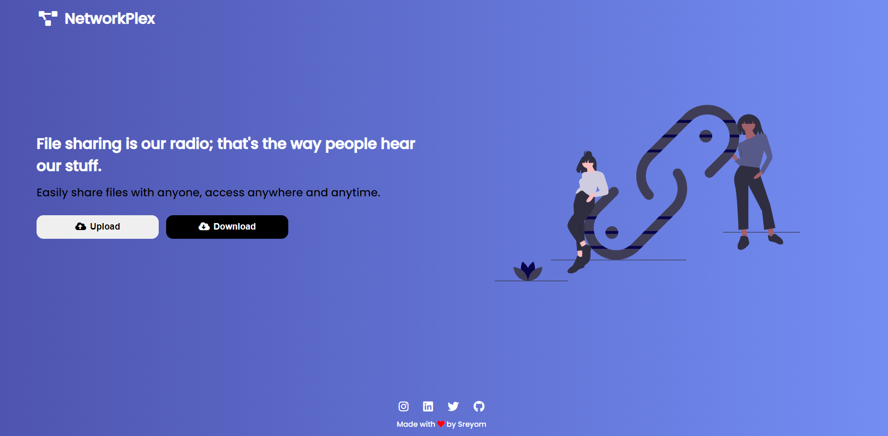

# **NetworkPlex**

## **[Website Link](https://networkplex.netlify.app/)**
&nbsp;

&nbsp;

## Built With

### This project is built using React, Node, Express, Multer, AWS S3.

---
Frontend is made using react library and backend is made using nodejs and express.
---
### [Frontend Github Link](https://github.com/sreyom31/One-Time-Share-Frontend)
### [Backend Github Link](https://github.com/sreyom31/One-Time-Share-Backend)

---
Frontend is deployed on netlify and backend is deployed on heroku.
---
### [Frontend Deployment Link](https://networkplex.netlify.app/)
### [Backend Deployment Link](https://networkplex.herokuapp.com/)

---
### File Sharing Website using AWS S3
- Upload files and share them with your friends
- File Sharing Limit
- One time downloadable link

# Get Started
## *Requirements*
 

 - [x] React
 - [x] Node
 - [x] AWS Account

 *Clone the repository to your loacal machine*
 

    git clone https://github.com/sreyom31/One-Time-Share-Backend
    
 *Change Directory to the base folder*
 

    cd One-Time-Share-Backend
  *Install the Dependencies*
 

    npm install
 *Run the Development Environment*
 

    npm run dev
